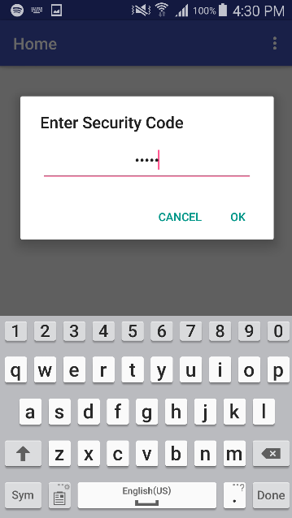
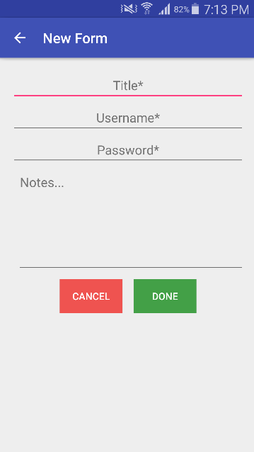
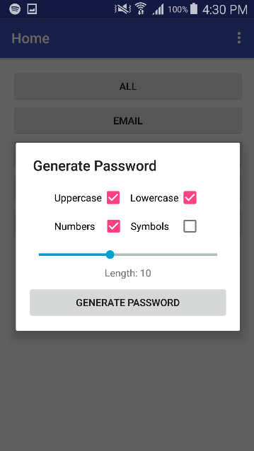

# Password Saver App
An android application that saves and organizes account passwords on the device. All data is saved and encrypted in a file on the device's external storage. 
Also includes many other features such as searching, sorting, moving accounts, and generating custom passwords.

   
   .png)
